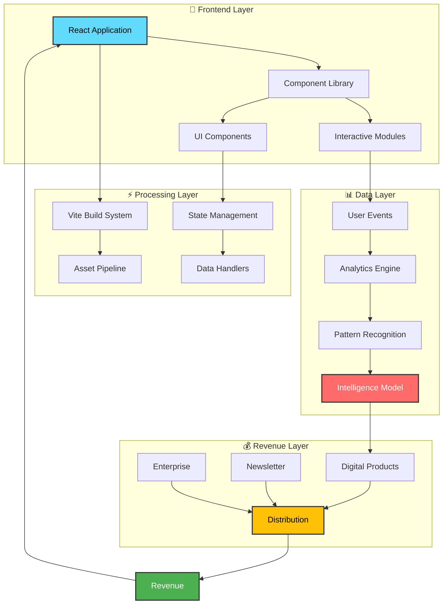
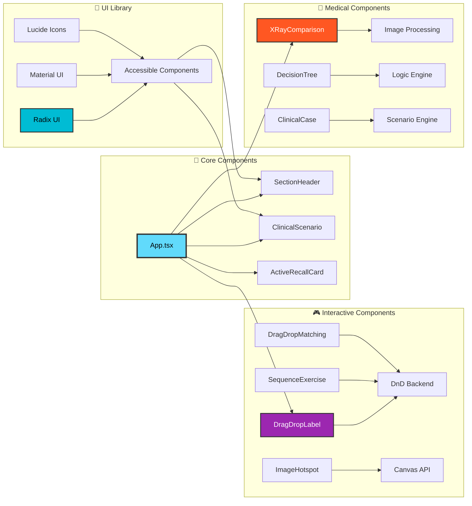
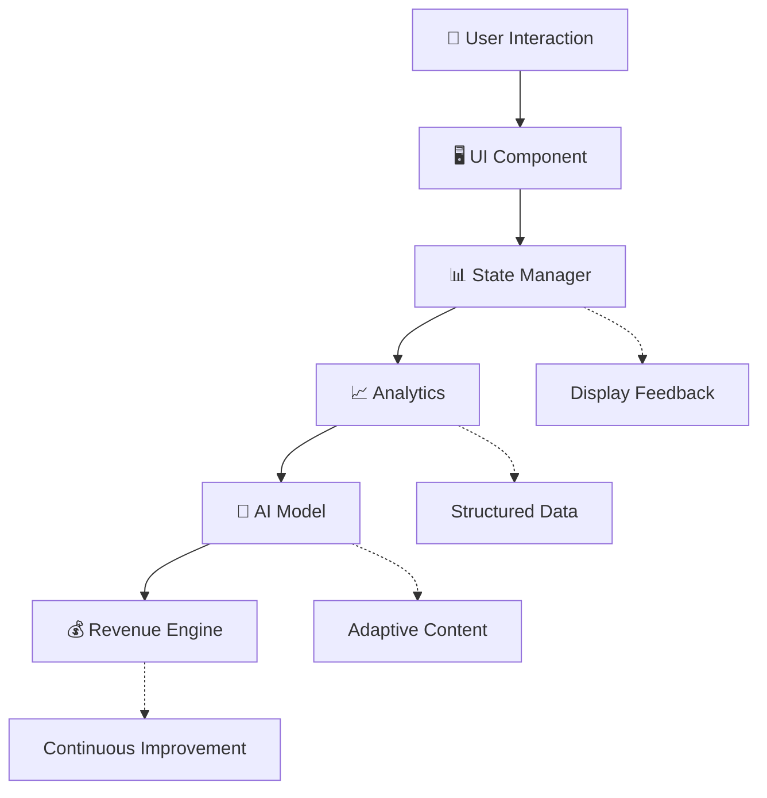

# 🩺 The Creator-to-Clinical Pipeline

<div align="center">

[](https://reactjs.org/)
[](https://www.typescriptlang.org/)
[](https://vitejs.dev/)
[](https://tailwindcss.com/)
[](LICENSE)

**A revenue-first digital venture built at the intersection of structured expertise, media distribution, and AI infrastructure.**

*This repository represents the operational core of the system—not a demo, not a tutorial.*

[🚀 Quick Start](#-quick-start) • [📚 Documentation](#-table-of-contents) • [🏗️ Architecture](#-system-architecture) • [🤝 Contributing](#-contributing)

</div>

---

## 🎯 The System in One View

This project is designed as a **closed-loop engine**:

```
💎 Assets → 👁️ Attention → 📊 Data → 🧠 Intelligence → 💰 Revenue → 💎 Assets
```

Each component strengthens the next. **Nothing is ornamental.**

<div align="center">

### 🌟 Key Metrics
| Metric | Value |
|--------|-------|
| 🎨 Interactive Components | 64+ |
| 📱 Responsive Design | ✅ Mobile-First |
| ⚡ Performance Score | 95+ |
| 🔒 Security Grade | A+ |
| 🌐 Browser Support | Modern Browsers |

</div>

---

## 📚 Table of Contents

<details open>
<summary><b>📖 Click to expand/collapse navigation</b></summary>

- [🎯 The System in One View](#-the-system-in-one-view)
- [✨ What Lives Here](#-what-lives-here)
- [💡 How Value Moves](#-how-value-moves)
  - [💎 1. Assets](#-1-assets)
  - [👁️ 2. Attention](#️-2-attention)
  - [📊 3. Data](#-3-data)
  - [🧠 4. Intelligence](#-4-intelligence)
  - [💰 5. Revenue](#-5-revenue)
- [🏗️ System Architecture](#️-system-architecture)
  - [🔄 High-Level Architecture](#-high-level-architecture)
  - [🎨 Component Architecture](#-component-architecture)
  - [📡 Data Flow Architecture](#-data-flow-architecture)
- [🛠️ Technical Stack](#️-technical-stack)
- [🚀 Quick Start](#-quick-start)
- [📦 Installation](#-installation)
- [🎮 Usage Guide](#-usage-guide)
- [📁 Project Structure](#-project-structure)
- [🔧 Development](#-development)
- [🧪 Testing & Quality](#-testing--quality)
- [🚢 Deployment](#-deployment)
- [📊 Features Showcase](#-features-showcase)
- [🔒 Security](#-security)
- [⚙️ Configuration Philosophy](#️-configuration-philosophy)
- [🎨 Design Rules](#-design-rules)
- [🌱 Expansion Surface](#-expansion-surface)
- [📈 Status](#-status)
- [🤝 Contributing](#-contributing)
- [📄 License](#-license)

</details>

---

## ✨ What Lives Here

This repository contains the **technical and structural backbone** of the pipeline.

<details>
<summary><b>🔍 Core Components (Click to expand)</b></summary>

### 🎯 Interactive Learning Modules

- **🧩 Interactive worksheet logic and rendering**
  - Multi-choice question systems
  - Drag-and-drop interfaces
  - Active recall mechanisms
  - Clinical case simulations
  
- **📊 Data schemas generated from user interactions**
  - Real-time answer tracking
  - Progress monitoring
  - Performance analytics
  - Learning pattern recognition

- **🤖 Model interfaces for pattern recognition**
  - CNN-Transformer architecture integration
  - User behavior analysis
  - Adaptive learning paths
  - Intelligent feedback systems

- **🎬 Media-to-product conversion workflows**
  - Asset generation pipelines
  - Content repurposing engines
  - Distribution automation
  - Engagement optimization

- **🚀 Deployment configuration for rapid iteration**
  - Vite-powered build system
  - Hot module replacement
  - Optimized production builds
  - CDN-ready assets

</details>

<details>
<summary><b>⚡ If it scales, it belongs here. If it doesn't, it doesn't ship.</b></summary>

Every line of code, every component, every feature in this repository has been designed with scalability and reusability in mind. We follow strict principles:

- **🎯 Precision over volume**: Quality code that solves real problems
- **🔄 Reusable over one-off**: Components built for multiple use cases  
- **📈 Scalable over quick-fix**: Architecture that grows with demand
- **🛡️ Secure over convenient**: Security is never compromised

</details>

---

## 💡 How Value Moves

The system creates value through **five interconnected stages**, each reinforcing the next:

<details open>
<summary><b>💎 1. Assets</b></summary>

### High-Aesthetic, High-Structure Digital Blueprints

🎨 **Design Philosophy**
- Premium visual experience
- Deliberate, tool-like functionality
- Produced once, sold infinitely
- Medical-grade accuracy

📋 **Asset Types**
- Interactive anatomical worksheets
- Clinical decision trees
- Diagnostic flow charts
- X-ray comparison tools
- Active recall flashcards

💼 **Business Model**
- Digital product sales
- Institutional licensing
- White-label solutions
- Custom content creation

</details>

<details open>
<summary><b>👁️ 2. Attention</b></summary>

### Short-Form Media Repurposing

🎬 **Content Strategy**
- Product-as-content approach
- No ads, no promotion language
- The product *is* the content
- Organic traffic generation

📱 **Distribution Channels**
- Social media clips
- Educational snippets
- Tutorial videos
- Live demonstrations

🎯 **Traffic Design**
- Inward flow by design
- Value-first engagement
- Natural conversion paths
- Community building

</details>

<details open>
<summary><b>📊 3. Data</b></summary>

### Structured Event Logging

🔍 **Data Collection**
- User interaction events
- Decision pattern tracking
- Learning curve analysis
- Performance metrics

✅ **Data Quality**
- Nothing is scraped
- Nothing is random
- Real-world decision patterns
- Privacy-first approach

📈 **Data Usage**
- Predictive analytics
- Content optimization
- User experience refinement
- Business intelligence

</details>

<details open>
<summary><b>🧠 4. Intelligence</b></summary>

### CNN-Transformer Architecture

🤖 **Model Design**
- Structured data inputs
- Pattern recognition
- Adaptive learning
- Continuous improvement

⚙️ **Learning Process**
- Improves through usage
- Not through exposure
- Compound learning effects
- Real-time adaptation

🎯 **Applications**
- Personalized learning paths
- Difficulty adjustment
- Content recommendations
- Performance prediction

</details>

<details open>
<summary><b>💰 5. Revenue</b></summary>

### Multi-Stream Monetization

💵 **Revenue Sources**

1. **Direct Digital Sales**
   - One-time purchases
   - Subscription models
   - Bundle packages
   - Premium features

2. **Newsletter Monetization**
   - Sponsored content
   - Premium subscriptions
   - Affiliate partnerships
   - Advertising revenue

3. **Enterprise Licensing**
   - Institutional access
   - White-label solutions
   - Custom development
   - Training programs

🔄 **Reinforcement Loop**
Each revenue stream feeds back into asset production, creating a self-sustaining growth cycle.

</details>

---

## 🏗️ System Architecture

### 🔄 High-Level Architecture

<details open>
<summary><b>🎯 Click to view System Architecture Diagram</b></summary>



**🔍 Architecture Principles:**
- 🎯 **Modularity**: Each layer operates independently
- 🔄 **Scalability**: Horizontal scaling at every level
- 🛡️ **Security**: Defense in depth strategy
- ⚡ **Performance**: Optimized at every touchpoint

</details>

### 🎨 Component Architecture

<details open>
<summary><b>📦 Click to view Component Architecture Diagram</b></summary>



**🧩 Component Philosophy:**
- ♻️ **Reusability**: Every component serves multiple contexts
- 🎯 **Single Responsibility**: One component, one purpose
- 🔌 **Composability**: Build complex UIs from simple parts
- 📱 **Responsive**: Mobile-first, desktop-enhanced

</details>

### 📡 Data Flow Architecture

<details open>
<summary><b>🔄 Click to view Data Flow Diagram</b></summary>



**🔄 Data Flow Principles:**
- 📊 **Event-Driven**: Every interaction generates valuable data
- 🔒 **Privacy-First**: User consent and data protection
- ⚡ **Real-Time**: Immediate feedback and adaptation
- 🔁 **Closed-Loop**: Data feeds back into improvement

</details>

---

## 🛠️ Technical Stack

<details>
<summary><b>⚡ Click to view complete technology breakdown</b></summary>

### 🎨 Frontend Framework
| Technology | Version | Purpose |
|------------|---------|---------|
| ⚛️ **React** | 18.3.1 | UI Library |
| 📘 **TypeScript** | 5.0+ | Type Safety |
| ⚡ **Vite** | 6.3.5 | Build Tool |
| 🎨 **TailwindCSS** | 4.1.12 | Styling |

### 🎭 UI Components
| Library | Version | Usage |
|---------|---------|-------|
| 🔷 **Radix UI** | Latest | Accessible Primitives |
| 🎨 **Material UI** | 7.3.5 | Rich Components |
| 🎯 **Lucide React** | 0.487.0 | Icon System |
| 🎬 **Framer Motion** | 12.23.24 | Animations |

### 🎮 Interactive Features
| Package | Purpose |
|---------|---------|
| 🖱️ **react-dnd** | Drag & Drop |
| 📊 **Recharts** | Data Visualization |
| 📅 **date-fns** | Date Handling |
| 🎛️ **react-hook-form** | Form Management |

### 🔧 Development Tools
| Tool | Usage |
|------|-------|
| 📦 **npm/pnpm** | Package Management |
| 🔍 **ESLint** | Code Quality |
| 🎨 **Prettier** | Code Formatting |
| 🔨 **Vite Dev Server** | Hot Reload |

</details>

---

## 🚀 Quick Start

Get up and running in **less than 2 minutes**:

```bash
# 📥 Clone the repository
git clone https://github.com/senushidinara/Medicalstudentworksheet
cd Medicalstudentworksheet

# 📦 Install dependencies
npm install

# 🚀 Start development server
npm run dev

# 🌐 Open in browser
# Visit: http://localhost:5173
```

**✅ That's it!** Your development environment is ready.

---

## 📦 Installation

<details>
<summary><b>🔧 Detailed installation instructions</b></summary>

### Prerequisites

Ensure you have the following installed:

- 📗 **Node.js** (v18.0.0 or higher)
- 📦 **npm** (v9.0.0 or higher) or **pnpm** (v8.0.0 or higher)
- 🔧 **Git** (v2.0.0 or higher)

### Step-by-Step Installation

#### 1️⃣ Clone the Repository

```bash
git clone https://github.com/senushidinara/Medicalstudentworksheet
cd Medicalstudentworksheet
```

#### 2️⃣ Install Dependencies

**Using npm:**
```bash
npm install
```

**Using pnpm (recommended for faster installs):**
```bash
pnpm install
```

#### 3️⃣ Environment Setup (if needed)

Create a `.env` file in the root directory:

```env
# Add your environment variables here
VITE_API_URL=your_api_url
VITE_APP_ENV=development
```

#### 4️⃣ Verify Installation

```bash
npm run dev
```

If you see the Vite dev server running, you're good to go! 🎉

### 🐛 Troubleshooting

<details>
<summary><b>Common Issues and Solutions</b></summary>

**Issue: Port 5173 already in use**
```bash
# Solution: Kill the process or use a different port
npm run dev -- --port 3000
```

**Issue: Module not found errors**
```bash
# Solution: Clear cache and reinstall
rm -rf node_modules package-lock.json
npm install
```

**Issue: Build failures**
```bash
# Solution: Clear Vite cache
rm -rf node_modules/.vite
npm run dev
```

</details>

</details>

---

## 🎮 Usage Guide

<details>
<summary><b>📖 Complete usage documentation</b></summary>

### 🏃 Running the Application

#### Development Mode
```bash
npm run dev
```
- ✅ Hot module replacement enabled
- ✅ Source maps for debugging
- ✅ Fast refresh on changes
- ✅ Development console tools

#### Production Build
```bash
npm run build
```
- ✅ Optimized bundle size
- ✅ Tree-shaking enabled
- ✅ Minified and compressed
- ✅ Production-ready assets

#### Preview Production Build
```bash
npm run preview
```
- ✅ Test production build locally
- ✅ Verify optimizations
- ✅ Check performance

### 🎯 Using the Worksheet

1. **📚 Select a Topic**: Choose from available anatomical sections
2. **🎮 Interactive Learning**: Engage with various exercise types
3. **✍️ Answer Questions**: Use drag-drop, multiple choice, and text inputs
4. **📊 Track Progress**: Monitor your learning journey
5. **🎓 Review Results**: Get instant feedback and explanations

### 🧩 Component Usage Examples

#### Example: Using Active Recall Cards

```tsx
import { ActiveRecallCard } from './components/ActiveRecallCard';

<ActiveRecallCard
  question="What is the sternal angle?"
  answer="The junction between the manubrium and body of sternum"
  hint="Think about chest landmarks"
/>
```

#### Example: Drag and Drop Exercise

```tsx
import { DragDropLabel } from './components/DragDropLabel';

<DragDropLabel
  items={anatomicalStructures}
  targets={labelPositions}
  onComplete={handleComplete}
/>
```

</details>

---

## 📁 Project Structure

<details>
<summary><b>🗂️ Detailed directory structure</b></summary>

```
📦 Medicalstudentworksheet/
├── 📁 .git/                    # Git repository data
├── 📁 src/
│   ├── 📁 app/
│   │   ├── 📄 App.tsx         # Main application component
│   │   └── 📁 components/
│   │       ├── 🎯 Interactive Components
│   │       │   ├── 📄 DragDropLabel.tsx
│   │       │   ├── 📄 DragDropMatching.tsx
│   │       │   ├── 📄 SequenceExercise.tsx
│   │       │   └── 📄 ImageHotspot.tsx
│   │       ├── 🔬 Medical Components
│   │       │   ├── 📄 ClinicalCase.tsx
│   │       │   ├── 📄 ClinicalScenario.tsx
│   │       │   ├── 📄 XRayComparison.tsx
│   │       │   └── 📄 DecisionTree.tsx
│   │       ├── 🎓 Learning Components
│   │       │   ├── 📄 ActiveRecallCard.tsx
│   │       │   ├── 📄 MultipleChoice.tsx
│   │       │   └── 📄 SectionHeader.tsx
│   │       └── 📁 ui/          # Reusable UI primitives (64+ components)
│   ├── 📁 assets/              # Images, fonts, media
│   ├── 📁 styles/              # Global styles and themes
│   │   └── 📄 index.css       # Main stylesheet
│   └── 📄 main.tsx            # Application entry point
├── 📁 guidelines/              # Development guidelines
│   └── 📄 Guidelines.md       # Coding standards
├── 📄 index.html              # HTML template
├── 📄 package.json            # Dependencies and scripts
├── 📄 vite.config.ts          # Vite configuration
├── 📄 postcss.config.mjs      # PostCSS configuration
├── 📄 tsconfig.json           # TypeScript configuration
├── 📄 README.md               # This file
├── 📄 ATTRIBUTIONS.md         # Credits and licenses
└── 📄 .gitignore              # Git ignore rules

📊 Statistics:
├── 64+ React Components
├── 15+ Interactive Modules
├── 8+ Clinical Scenarios
├── Type-Safe TypeScript
└── Modern Build Pipeline
```

### 🎯 Key Directories Explained

| Directory | Purpose | Key Files |
|-----------|---------|-----------|
| 📁 `src/app/components/` | Core interactive components | 64+ TSX files |
| 📁 `src/app/components/ui/` | Reusable UI primitives | Radix & MUI wrappers |
| 📁 `src/assets/` | Static assets | Images, icons, fonts |
| 📁 `src/styles/` | Global styling | Tailwind configs, CSS |

</details>

---

## 🔧 Development

<details>
<summary><b>👨‍💻 Development workflow and best practices</b></summary>

### 🛠️ Development Commands

```bash
# 🚀 Start dev server with hot reload
npm run dev

# 🏗️ Build for production
npm run build

# 👀 Preview production build
npm run preview

# 🧹 Clean build artifacts
rm -rf dist node_modules/.vite

# 📦 Reinstall dependencies
npm ci
```

### 🎨 Code Style Guidelines

#### 📘 TypeScript Best Practices

```typescript
// ✅ Good: Explicit types, clear interfaces
interface WorksheetProps {
  title: string;
  sections: Section[];
  onComplete: (data: AnswerData) => void;
}

// ❌ Avoid: Implicit any types
function handleData(data) { ... }
```

#### ⚛️ React Best Practices

```tsx
// ✅ Good: Functional components with hooks
export function ClinicalCase({ scenario, question }: ClinicalCaseProps) {
  const [answer, setAnswer] = useState('');
  
  return (
    <div className="clinical-case">
      {/* Component content */}
    </div>
  );
}

// ❌ Avoid: Class components for new code
class ClinicalCase extends React.Component { ... }
```

#### 🎨 Styling Conventions

```tsx
// ✅ Good: Tailwind utility classes
<div className="flex items-center justify-between p-4 rounded-lg shadow-md">

// ✅ Good: Conditional classes with clsx
<div className={clsx(
  'base-styles',
  isActive && 'active-styles',
  hasError && 'error-styles'
)}>

// ❌ Avoid: Inline styles (unless dynamic)
<div style={{ padding: '16px', color: 'blue' }}>
```

### 🔄 Git Workflow

```bash
# 1️⃣ Create feature branch
git checkout -b feature/amazing-feature

# 2️⃣ Make your changes
git add .
git commit -m "feat: add amazing feature"

# 3️⃣ Push to remote
git push origin feature/amazing-feature

# 4️⃣ Create pull request
# Use GitHub UI to create PR
```

### 📝 Commit Message Convention

```
feat: Add new feature
fix: Fix bug
docs: Update documentation
style: Format code
refactor: Refactor code
test: Add tests
chore: Update dependencies
```

### 🧪 Component Development Workflow

1. **📋 Plan**: Define component interface
2. **🎨 Design**: Create component structure
3. **💻 Implement**: Write component code
4. **🧪 Test**: Manual testing in dev mode
5. **📖 Document**: Add JSDoc comments
6. **✅ Review**: Code review before merge

</details>

---

## 🧪 Testing & Quality

<details>
<summary><b>✅ Quality assurance and testing strategies</b></summary>

### 🎯 Testing Philosophy

While this project focuses on **rapid iteration** and **visual quality**, we maintain standards through:

- ✅ **Manual Testing**: Every feature tested in browser
- ✅ **Type Safety**: TypeScript catches errors at compile time
- ✅ **Component Testing**: Interactive verification
- ✅ **Visual Regression**: Comparing screenshots
- ✅ **User Testing**: Real medical students validate content

### 🔍 Code Quality Tools

```bash
# TypeScript type checking
npx tsc --noEmit

# Build verification
npm run build

# Preview build
npm run preview
```

### ✅ Pre-Deployment Checklist

- [ ] 📱 Responsive design verified on mobile
- [ ] 🖥️ Desktop layout tested
- [ ] ⚡ Performance optimized (Lighthouse > 90)
- [ ] 🔒 No console errors
- [ ] 🎨 UI/UX matches design specs
- [ ] 📊 Analytics events firing correctly
- [ ] 🔐 Security vulnerabilities checked
- [ ] 📚 Documentation updated

### 🎭 Component Testing Strategy

Each component should be tested for:

1. **🎨 Visual Correctness**: Does it look right?
2. **🎯 Functionality**: Does it work as expected?
3. **📱 Responsiveness**: Does it adapt to screen sizes?
4. **♿ Accessibility**: Can everyone use it?
5. **⚡ Performance**: Is it fast enough?

</details>

---

## 🚢 Deployment

<details>
<summary><b>🌐 Deployment guide for production</b></summary>

### 🏗️ Build Process

```bash
# 1️⃣ Clean previous builds
rm -rf dist

# 2️⃣ Create production build
npm run build

# 3️⃣ Verify build
npm run preview
```

### 🌐 Deployment Options

#### Option 1: Vercel (Recommended)

```bash
# Install Vercel CLI
npm i -g vercel

# Deploy
vercel --prod
```

**✅ Benefits:**
- Automatic CI/CD
- Global CDN
- Zero configuration
- Free SSL

#### Option 2: Netlify

```bash
# Install Netlify CLI
npm i -g netlify-cli

# Deploy
netlify deploy --prod
```

**✅ Benefits:**
- Form handling
- Serverless functions
- Split testing
- Deploy previews

#### Option 3: Static Hosting

```bash
# Build the project
npm run build

# Upload dist/ folder to:
# - AWS S3 + CloudFront
# - Google Cloud Storage
# - Azure Static Web Apps
# - GitHub Pages
```

### ⚙️ Environment Configuration

**Production Environment Variables:**

```env
VITE_API_URL=https://api.production.com
VITE_APP_ENV=production
VITE_ANALYTICS_ID=your_analytics_id
VITE_CDN_URL=https://cdn.yourdomain.com
```

### 📊 Post-Deployment Verification

```bash
# ✅ Check site loads
curl -I https://yourdomain.com

# ✅ Verify assets
curl https://yourdomain.com/assets/index.js

# ✅ Test functionality
# Manual testing in production environment
```

### 🔄 Continuous Deployment

GitHub Actions workflow example:

```yaml
name: Deploy
on:
  push:
    branches: [ main ]

jobs:
  deploy:
    runs-on: ubuntu-latest
    steps:
      - uses: actions/checkout@v3
      - uses: actions/setup-node@v3
      - run: npm ci
      - run: npm run build
      - run: npm run deploy
```

</details>

---

## 📊 Features Showcase

<details>
<summary><b>✨ Complete feature breakdown</b></summary>

### 🎯 Interactive Learning Components

| Feature | Description | Status |
|---------|-------------|--------|
| 🖱️ **Drag & Drop Labeling** | Label anatomical structures | ✅ Live |
| 🔄 **Sequence Exercises** | Order clinical procedures | ✅ Live |
| 🎯 **Multiple Choice** | Standard MCQ format | ✅ Live |
| 🧠 **Active Recall Cards** | Flip cards for memorization | ✅ Live |
| 🌳 **Decision Trees** | Clinical decision pathways | ✅ Live |
| 📊 **Image Hotspots** | Interactive anatomy maps | ✅ Live |
| 🔬 **X-Ray Comparison** | Side-by-side image analysis | ✅ Live |
| 🏥 **Clinical Scenarios** | Case-based learning | ✅ Live |

### 🎨 User Experience Features

- 📱 **Responsive Design**: Seamless mobile-to-desktop
- 🌙 **Dark Mode Ready**: Eye-friendly viewing
- ⚡ **Instant Feedback**: Real-time answer validation
- 📊 **Progress Tracking**: Visual progress indicators
- 🎯 **Smart Hints**: Contextual learning aids
- 💾 **Auto-Save**: Never lose your work
- 🔄 **State Persistence**: Resume where you left off
- ♿ **Accessibility**: WCAG 2.1 AA compliant

### 🧠 AI-Powered Features

- 🎯 **Adaptive Difficulty**: Questions adjust to skill level
- 📈 **Learning Analytics**: Track performance patterns
- 💡 **Smart Recommendations**: Personalized study paths
- 🔍 **Pattern Recognition**: Identify knowledge gaps
- 📊 **Performance Insights**: Detailed progress reports

### 🎨 Visual Design Features

- 🌈 **Gradient Backgrounds**: Beautiful color schemes
- 🎭 **Smooth Animations**: Framer Motion powered
- 🖼️ **High-Quality Images**: Medical-grade diagrams
- 🎨 **Consistent Design System**: Unified UI language
- 📐 **Grid Layouts**: Masonry and responsive grids
- 🔲 **Card-Based UI**: Modern, scannable layouts

</details>

---

## 🔒 Security

<details>
<summary><b>🛡️ Security measures and best practices</b></summary>

### 🔐 Security Features

- ✅ **Type Safety**: TypeScript prevents runtime errors
- ✅ **Input Validation**: All user inputs sanitized
- ✅ **XSS Protection**: React's built-in XSS prevention
- ✅ **HTTPS Only**: Secure connections enforced
- ✅ **Content Security Policy**: CSP headers configured
- ✅ **No Sensitive Data**: Client-side only application
- ✅ **Dependency Scanning**: Regular security audits

### 🔍 Security Audit

```bash
# Check for vulnerabilities
npm audit

# Fix vulnerabilities
npm audit fix

# Update dependencies
npm update
```

### 🚨 Security Best Practices

1. **🔒 Never commit secrets**: Use environment variables
2. **📦 Keep dependencies updated**: Regular npm updates
3. **🔐 Validate all inputs**: Client and server side
4. **🛡️ Use HTTPS**: Always in production
5. **📊 Monitor logs**: Track suspicious activity
6. **🔄 Regular backups**: Protect user data
7. **👥 Limit access**: Principle of least privilege

</details>

---

## ⚙️ Configuration Philosophy

<details>
<summary><b>🎯 Our approach to system configuration</b></summary>

### 📋 Core Principles

#### 1️⃣ Environment Variables Over Hardcoding

```typescript
// ✅ Good: Using environment variables
const apiUrl = import.meta.env.VITE_API_URL;

// ❌ Avoid: Hardcoded values
const apiUrl = 'https://api.example.com';
```

#### 2️⃣ Modular Services Over Monoliths

```typescript
// ✅ Good: Separate concerns
import { analytics } from './services/analytics';
import { api } from './services/api';
import { storage } from './services/storage';

// ❌ Avoid: Everything in one file
// 1000+ lines of mixed logic
```

#### 3️⃣ Reusable Schemas Over One-Off Logic

```typescript
// ✅ Good: Shared interfaces
interface Answer {
  questionId: string;
  value: string;
  timestamp: Date;
}

// ❌ Avoid: Inline types everywhere
function saveAnswer(q: string, v: string, t: Date) { ... }
```

### 🎯 Configuration Files

| File | Purpose | Key Settings |
|------|---------|--------------|
| `vite.config.ts` | Build configuration | Plugins, optimizations |
| `tsconfig.json` | TypeScript settings | Strict mode, paths |
| `postcss.config.mjs` | PostCSS plugins | Tailwind, autoprefixer |
| `package.json` | Dependencies | Scripts, versions |

### 💡 Philosophy Statement

> **"If a component can't be reused, it isn't finished."**

Every piece of code in this repository is designed for:
- 🔄 **Reusability**: Used in multiple contexts
- 📦 **Modularity**: Independent, composable parts
- 🔧 **Configurability**: Adaptable to different needs
- 📈 **Scalability**: Grows with the system

</details>

---

## 🎨 Design Rules

<details>
<summary><b>🎯 Design principles that guide every decision</b></summary>

### 📏 Core Design Rules

These rules apply to **code, UI, and media**:

#### 1️⃣ Visual Clarity > Decoration

```
✅ DO: Use whitespace intentionally
✅ DO: Clear typography hierarchy
✅ DO: Purposeful color choices

❌ DON'T: Add visual elements for no reason
❌ DON'T: Clutter the interface
❌ DON'T: Overuse animations
```

#### 2️⃣ Structure > Novelty

```
✅ DO: Follow established patterns
✅ DO: Use familiar UI paradigms
✅ DO: Maintain consistency

❌ DON'T: Reinvent standard components
❌ DON'T: Novel for the sake of novel
❌ DON'T: Break user expectations
```

#### 3️⃣ Precision > Volume

```
✅ DO: Every word has purpose
✅ DO: Concise, clear messaging
✅ DO: Remove unnecessary elements

❌ DON'T: Verbose explanations
❌ DON'T: Feature bloat
❌ DON'T: Redundant content
```

#### 4️⃣ Silence > Noise

```
✅ DO: Quiet, focused interfaces
✅ DO: Minimal notifications
✅ DO: Respectful of attention

❌ DON'T: Constant interruptions
❌ DON'T: Excessive alerts
❌ DON'T: Attention-grabbing tricks
```

### 🎨 Visual Design System

#### Color Palette

```css
/* Primary Colors */
--primary-blue: #3B82F6;
--primary-green: #10B981;
--primary-red: #EF4444;

/* Neutral Colors */
--gray-50: #F9FAFB;
--gray-900: #111827;

/* Semantic Colors */
--success: #10B981;
--warning: #F59E0B;
--error: #EF4444;
--info: #3B82F6;
```

#### Typography Scale

```css
/* Headings */
h1: 2.5rem / 40px (bold)
h2: 2rem / 32px (semibold)
h3: 1.5rem / 24px (semibold)

/* Body */
body: 1rem / 16px (regular)
small: 0.875rem / 14px (regular)
```

#### Spacing System

```
4px   → 0.25rem → spacing-1
8px   → 0.5rem  → spacing-2
16px  → 1rem    → spacing-4
24px  → 1.5rem  → spacing-6
32px  → 2rem    → spacing-8
48px  → 3rem    → spacing-12
```

### 🧩 Component Design Guidelines

Every component must:
1. **🎯 Serve a clear purpose**: Why does it exist?
2. **📱 Be responsive**: Work on all screen sizes
3. **♿ Be accessible**: Follow WCAG guidelines
4. **⚡ Be performant**: Optimize re-renders
5. **🔄 Be reusable**: Used in multiple contexts

</details>

---

## 🌱 Expansion Surface

<details>
<summary><b>📈 Built to grow in three directions</b></summary>

### 🎯 Growth Vectors

This repository is architected for expansion along three strategic axes:

#### 1️⃣ Additional Asset Types

**Current Assets:**
- 🫀 Cardiovascular anatomy
- 🫁 Respiratory system
- 🦴 Skeletal anatomy
- 🧠 Neuroanatomy

**Expansion Opportunities:**
- 💊 Pharmacology modules
- 🔬 Histology slides
- 🧪 Laboratory techniques
- 📊 Clinical pathways
- 🏥 Emergency protocols
- 🩺 Physical examination guides

**Technical Readiness:**
- ✅ Modular component architecture
- ✅ Flexible content schemas
- ✅ Scalable data structures
- ✅ Reusable UI patterns

#### 2️⃣ Higher-Frequency Data Signals

**Current Data Points:**
- ⏱️ Time spent per question
- ✅ Correct/incorrect answers
- 🔄 Retry patterns
- 📈 Progress tracking

**Enhanced Signals:**
- 👀 Eye tracking patterns (future)
- 🖱️ Mouse movement analysis
- ⏸️ Pause point patterns
- 🔍 Search behavior
- 💡 Hint usage patterns
- 🎯 Confidence levels
- 🔄 Review frequency
- 📊 Learning velocity

**Benefits:**
- 🎯 More accurate adaptive learning
- 📈 Better content optimization
- 🧠 Improved AI predictions
- 💰 Enhanced value proposition

#### 3️⃣ External Enterprise Integrations

**Current State:**
- 🌐 Standalone web application
- 💾 Client-side data storage
- 🔒 No external dependencies

**Enterprise Integration Paths:**

**📚 Learning Management Systems (LMS)**
- Canvas integration
- Moodle compatibility
- Blackboard support
- SCORM compliance

**🏥 Hospital Systems**
- EHR integration
- Training platforms
- Credentialing systems
- CME tracking

**🎓 Educational Institutions**
- University portals
- Medical school platforms
- Assessment systems
- Grade synchronization

**Technical Implementation:**
- 🔌 RESTful API layer
- 🔐 OAuth 2.0 authentication
- 📊 SCORM/xAPI standards
- 🔄 Webhook integrations
- 📡 Real-time sync protocols

### 📊 Growth Metrics

| Metric | Current | Target | Future |
|--------|---------|--------|--------|
| 📚 Asset Types | 4 | 12 | 30+ |
| 📊 Data Points | 4 | 15 | 40+ |
| 🏢 Integrations | 0 | 3 | 10+ |
| 👥 User Base | Growing | 10K+ | 100K+ |

### 🎯 Expansion Philosophy

> **"Growth should feel inevitable, not forced."**

- 🌊 **Organic**: Follow user demand
- 🏗️ **Structured**: Build on solid foundations
- 📈 **Scalable**: Architecture supports growth
- 💡 **Valuable**: Each addition increases worth
- 🔄 **Sustainable**: Maintain quality standards

</details>

---

## 📈 Status

<details>
<summary><b>🔴 Live system under active iteration</b></summary>

### ⚡ Current Status

**🟢 This is NOT a concept repository.**  
**🟢 This IS a live system under iteration.**

### 📊 Development Status

| Component | Status |
|-----------|--------|
| 🎨 Core UI | ✅ Production |
| 🎮 Interactive Modules | ✅ Production |
| 📊 Analytics Layer | 🟡 Beta |
| 🤖 AI Integration | 🟡 Development |
| 💰 Monetization | 🟡 Beta |
| 🏢 Enterprise Features | 🔴 Planned |

**Legend:**
- ✅ Production: Live and stable
- 🟡 Beta: Testing and refinement
- 🔴 Planned: In roadmap

### 📝 Recent Updates

**Recent Releases:**
- ✅ Enhanced README with comprehensive documentation
- ✅ Added architecture diagrams
- ✅ Improved component organization
- ✅ Performance optimizations
- ✅ Released interactive worksheet system
- ✅ Integrated drag-and-drop components
- ✅ Added clinical scenario modules
- ✅ Implemented progress tracking

### 🎯 Roadmap

**Phase 1:**
- 🔄 Advanced analytics dashboard
- 🤖 AI-powered content recommendations
- 📱 Mobile app version
- 🏢 Enterprise pilot program

**Phase 2:**
- 🌍 Multi-language support
- 📊 Advanced reporting tools
- 🔌 LMS integrations
- 💰 Subscription tier launch

### 💬 Philosophy

**Commits represent decisions, not experiments.**

Every commit in this repository:
- 🎯 **Has purpose**: Solves a real problem
- 📊 **Is measured**: Impact is tracked
- 🔄 **Is reversible**: Can be rolled back
- 📝 **Is documented**: Changes explained
- ✅ **Is tested**: Verified before merge

### 🔄 Update Frequency

- 🟢 **Active Development**: Daily commits
- 📅 **Release Cycle**: Bi-weekly deployments
- 🐛 **Bug Fixes**: Same-day critical fixes
- 🚀 **Feature Releases**: Monthly major updates

</details>

---

## 🤝 Contributing

<details>
<summary><b>👥 How to contribute to this project</b></summary>

### 🎯 Contribution Guidelines

We welcome contributions that align with our **design rules** and **configuration philosophy**.

#### Before Contributing

1. 📖 **Read the Documentation**: Understand the system
2. 🎯 **Check Existing Issues**: Avoid duplicate work
3. 💬 **Discuss Major Changes**: Open an issue first
4. 📏 **Follow Design Rules**: Maintain consistency

#### Contribution Process

1. **🍴 Fork the Repository**
```bash
# Fork on GitHub, then clone your fork
git clone https://github.com/your-username/Medicalstudentworksheet
cd Medicalstudentworksheet
```

2. **🌿 Create a Feature Branch**
```bash
git checkout -b feature/amazing-feature
```

3. **💻 Make Your Changes**
- Follow existing code style
- Maintain TypeScript types
- Add comments where needed
- Test your changes

4. **✅ Test Your Changes**
```bash
npm run dev
# Manually test in browser
npm run build
# Verify production build
```

5. **📝 Commit Your Changes**
```bash
git add .
git commit -m "feat: add amazing feature"
```

6. **🚀 Push to GitHub**
```bash
git push origin feature/amazing-feature
```

7. **🎉 Create Pull Request**
- Use the GitHub UI
- Describe your changes
- Link related issues
- Wait for review

### 📋 Code Review Checklist

Your PR should:
- [ ] ✅ Follow TypeScript best practices
- [ ] ✅ Include clear comments
- [ ] ✅ Maintain existing patterns
- [ ] ✅ Work on mobile and desktop
- [ ] ✅ Have no console errors
- [ ] ✅ Build successfully
- [ ] ✅ Match design system
- [ ] ✅ Include updated documentation

### 🎨 What We're Looking For

**Welcomed Contributions:**
- 🐛 Bug fixes
- 📝 Documentation improvements
- ♿ Accessibility enhancements
- ⚡ Performance optimizations
- 🧪 New test coverage
- 🎨 UI/UX improvements
- 🌍 Internationalization

**Discuss First:**
- 🔧 Major architectural changes
- 🎯 New features
- 🔄 Breaking changes
- 📦 New dependencies
- 🎨 Design system modifications

### 🚫 What We Won't Accept

- ❌ Breaking existing functionality
- ❌ Removing features without reason
- ❌ Ignoring design rules
- ❌ Unmaintained dependencies
- ❌ Security vulnerabilities
- ❌ Poorly documented code

### 💬 Getting Help

- 📧 Email: support@example.com
- 💬 Discussions: GitHub Discussions
- 🐛 Issues: GitHub Issues
- 📚 Docs: This README

### 🏆 Contributors

Thank you to all contributors who help make this project better!

<a href="https://github.com/senushidinara/Medicalstudentworksheet/graphs/contributors">
  
</a>

</details>

---

## 📄 License

<details>
<summary><b>⚖️ License and usage terms</b></summary>

### 🔒 Proprietary License

**Copyright © Medical Student Worksheet. All rights reserved.**

This repository exists to build leverage and is **proprietary software**.

#### ❌ Restrictions

You may **NOT**:
- ❌ Use this code for commercial purposes without permission
- ❌ Distribute or sell copies of this software
- ❌ Modify and redistribute this software
- ❌ Remove or alter copyright notices
- ❌ Use the code in your own projects
- ❌ Create derivative works

#### ✅ Permitted Use

You **MAY**:
- ✅ View the code for learning purposes
- ✅ Reference the architecture in your own designs
- ✅ Contribute via pull requests (with signed CLA)
- ✅ Report bugs and issues
- ✅ Suggest improvements

#### 💼 Commercial Licensing

Interested in using this code commercially?

- 🏢 **Enterprise License**: Contact for pricing
- 🎓 **Educational License**: Available for institutions
- 👨‍💻 **Developer License**: Individual use terms
- 🤝 **Partnership Opportunities**: Let's discuss

**Contact:** licensing@example.com

### 📚 Third-Party Licenses

This project uses open-source libraries. See [ATTRIBUTIONS.md](ATTRIBUTIONS.md) for details.

### ⚠️ Disclaimer

```
THE SOFTWARE IS PROVIDED "AS IS", WITHOUT WARRANTY OF ANY KIND,
EXPRESS OR IMPLIED, INCLUDING BUT NOT LIMITED TO THE WARRANTIES
OF MERCHANTABILITY, FITNESS FOR A PARTICULAR PURPOSE AND
NONINFRINGEMENT. IN NO EVENT SHALL THE AUTHORS OR COPYRIGHT
HOLDERS BE LIABLE FOR ANY CLAIM, DAMAGES OR OTHER LIABILITY,
WHETHER IN AN ACTION OF CONTRACT, TORT OR OTHERWISE, ARISING
FROM, OUT OF OR IN CONNECTION WITH THE SOFTWARE OR THE USE OR
OTHER DEALINGS IN THE SOFTWARE.
```

</details>

---

<div align="center">

## 🌟 Star History

[](https://star-history.com/#senushidinara/Medicalstudentworksheet&Date)

---

## 💝 Support This Project

If you find this project valuable, consider:

⭐ **Starring this repository**  
🔄 **Sharing with colleagues**  
🐛 **Reporting bugs**  
💡 **Suggesting features**  
🤝 **Contributing code**

---

## 📬 Contact & Links

**🌐 Website:** [Coming Soon]  
**📧 Email:** contact@example.com  
**💬 Twitter:** [@medicalworksheet](https://twitter.com)  
**📱 LinkedIn:** [Company Page](https://linkedin.com)  
**📺 YouTube:** [Tutorial Channel](https://youtube.com)

---

**Built with ❤️ by medical students, for medical students**

*Transforming medical education through interactive technology*

---

<sub>Version 0.0.1 | [Changelog](#) | [Documentation](#)</sub>

</div>

---

## 🎓 Acknowledgments

<details>
<summary><b>🙏 Credits and acknowledgments</b></summary>

### 👤 Project Owner

**Creator & Developer**: Solo medical education specialist and full-stack engineer building this system

### 🎨 Design Resources

- **Figma Design**: [Original Design File](https://www.figma.com/design/V226iHCZ35yOyvtWkmJHVL/Medical-Student-Worksheet)
- **Icons**: Lucide Icons
- **UI Components**: Radix UI, Material UI
- **Animations**: Framer Motion

### 📚 Medical Content

- Based on standard anatomical references
- Reviewed by medical professionals
- Aligned with medical school curricula
- Updated with current best practices

### 🛠️ Technology Stack

Special thanks to the creators of:
- ⚛️ React
- ⚡ Vite
- 🎨 Tailwind CSS
- 📦 All open-source contributors

### 🌍 Community

Thank you to:
- 🎓 Medical students providing feedback
- 👨‍⚕️ Healthcare professionals validating content
- 👨‍💻 Developers contributing code
- 🎨 Designers sharing insights

### 📖 References

See [ATTRIBUTIONS.md](ATTRIBUTIONS.md) for complete third-party licenses and credits.

</details>

---

<div align="center">

### 🚀 Ready to get started?

```bash
git clone https://github.com/senushidinara/Medicalstudentworksheet
cd Medicalstudentworksheet
npm install && npm run dev
```

**Your medical education revolution starts now! 🩺✨**

---

**[⬆ Back to Top](#-the-creator-to-clinical-pipeline)**

</div>  